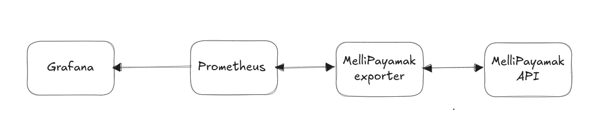
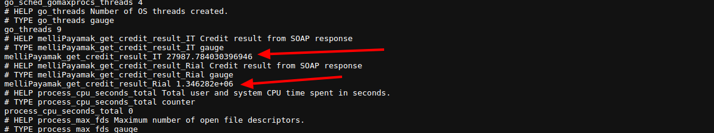
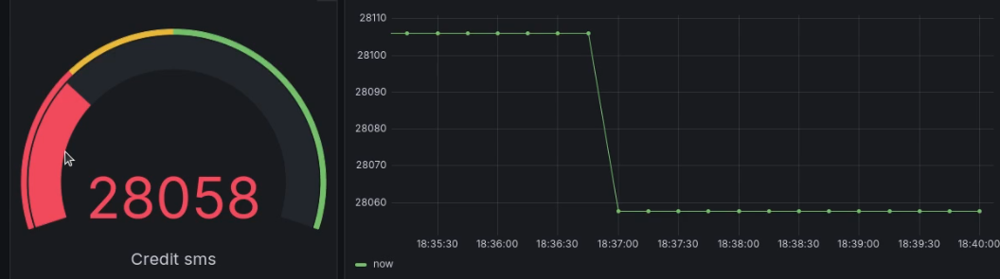

# melipayamakCredit
this is "melipayamak.com" sms credit exporter for Prometheus.




for run it:

- add user and pass in .env file
- `go mod init`
- `go mod tidy`
- `go run .`

then see something like this:
```sh
╰─⠠⠵ go run .
{"level":"warn","time":1763725512,"message":"Serving metrics on :8285/metrics"}
{"level":"warn","time":1763725512,"message":"Starting server on :8285"}
{"level":"warn","time":1763725512,"message":"2.7989784030396946E+04"}
{"level":"warn","time":1763725512,"message":"1.346282E+06"}
{"level":"warn","time":1763725572,"message":"2.7987784030396946E+04"}
{"level":"warn","time":1763725573,"message":"1.346282E+06"}
{"level":"warn","time":1763725633,"message":"2.7980684030396947E+04"}
{"level":"warn","time":1763725633,"message":"1.346282E+06"}
{"level":"warn","time":1763725693,"message":"2.7979684030396947E+04"}
{"level":"warn","time":1763725693,"message":"1.346282E+06"}

```


- check browser over target ip and port 8285 http://{target_ip}:82/85/metrics




then config `prometheus.yaml`

```yml
- job_name: "sms-charge"
  scrape_interval: 5m
  static_configs:
    - targets: [{target_ip}:8285]
```


the metrics name are:

`melliPayamak_get_credit_result_IT` -> for credit SMS 

and

`melliPayamak_get_credit_result_Rial` -> for remind Rial


then added prometheus to grafana dataSource and create dashboard and alert like:




### docker run

```sh
docker run --rm  --env-file .env   -p 8285:8285   dannyravi/mellipayamak-exporter:0.0.1
```

#### remember user and password must be correct in .env file!!


### next step

- [ ] alertmanager
- [ ] custom user
- [ ] add docker-compose for fire and forgot mechanism
- [ ] add grafana dynamic dashboard
- [ ] add remote control 
- [ ] design concurrent controller
- [ ] robost code